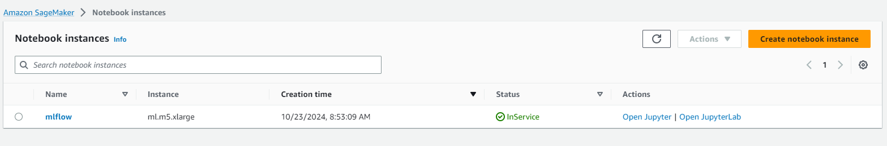
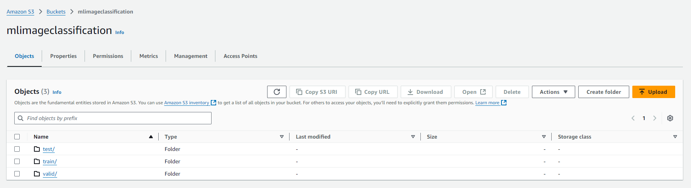
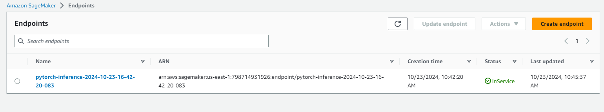
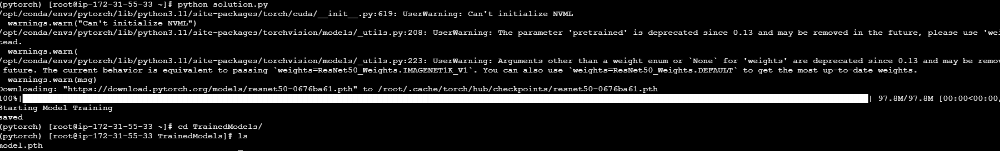
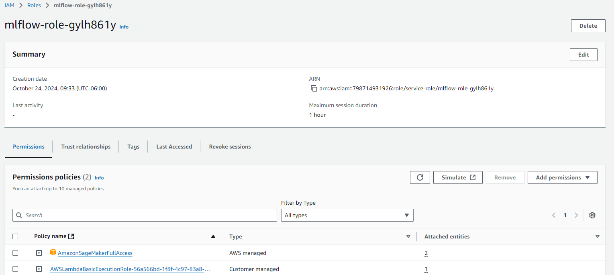
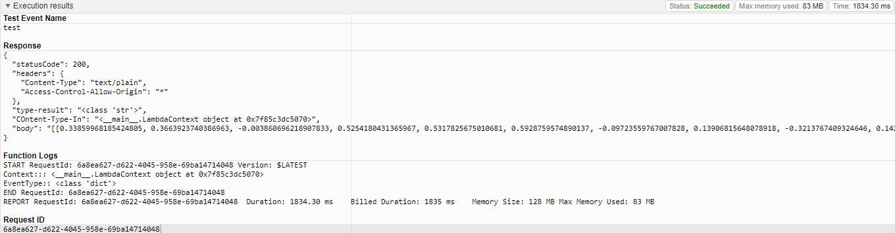
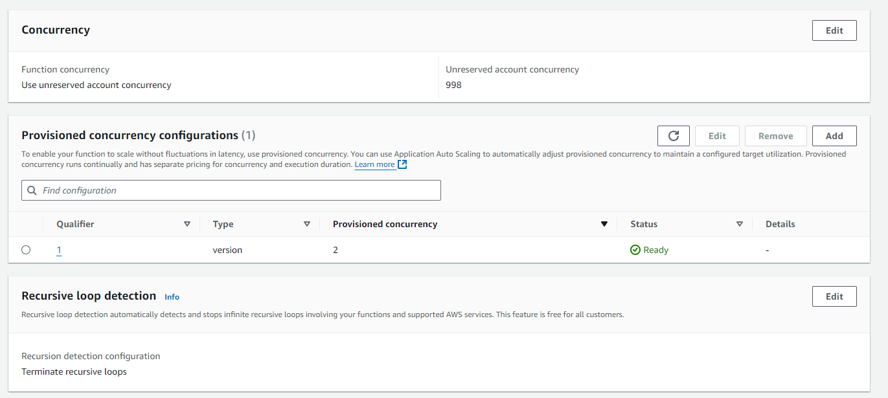
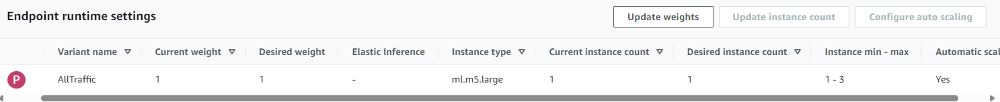

# Operationalizing an AWS ML Project

## Notebook setup

The first step of training and deploying a model is creating a notebook on Sagemaker. Below we can see a screenshot of the notebook instance created. I selected a ml.m5.xlarge instance type to speed up training of our model.

## S3 Setup

We also need an s3 bucket to hold all of the training and model artifacts. Below you can see I created one and uploaded all of the test, train, and validation dataset from the dogimages.

## Training the model

After we setup our notebook and the S3 bucket, we can run the train_and_deploy.ipynb file to train the model and create a deployed endpoint in Sagemaker. Below is a screenshot of the deployment.

You can also see from the notebook code that I bumbped the instance count from 1 to 5 in the second training run for the estimator.

## EC2 Setup

For the EC2 instance setup, there were a number of decisions about the configuration that had to be made. First, you have to give it a name of your choosing, then choose and Amazon Machine Image. For this project I selected the Amason Linux OS with the Deep Learning OSS Nvidia Driver AMI with PyTorch 2.3 since that is what we will be using to train our model. Next, we need to choose an EC2 instance that is supported by this AMI. According to the documentation, this type of AMI supports the following instances: G3, P3, P3dn, P4d, G5, and G4dn. I decided to choose the g3s.xlarge instance since it met the vCPU restraints, wasn't that costly, and had a good amount of memory. The final step was creating a key pair to securely connect to the instance if needed.

EC2 instances can be easily scaled up or down based on computing needs, can be customized to meet specific requirements such as framework (pytroch or tensorflow), number of CPUs, memory size and GPU support and EC2 instances can be optimized for high-performance computing, which can greatly reduce the time it takes to train large machine learning models.

Notebook instances have their own advantages too such as: quick setup as they comes with pre-configured with popular machine learning frameworks and libraries, easy collaboration and integration with others AWS services such as AWS SageMaker, which provides a lot of tools required for machine learning engineering and operations.

## Lambda Function

Take a look in the [lamda function python file](lamdafunction.py) to see the endpoint has been updated to reflect the correct one and there is a return statement including a status code, headers, and body content.

I also updated the IAM role to allow the lambda function to access Sagemaker commands. In the screenshot below, we can see an attached policy of "SagemakerFullAccess" allows the lambda function to work. The response from testing the lambda function after the IAM role was introduced can be see below as well.

[0.33859968185424805, 0.3663923740386963, -0.003860696218907833, 0.5254180431365967, 0.5317825675010681, 0.5928759574890137, -0.09723559767007828, 0.13906815648078918, -0.3213767409324646, 0.14250245690345764, 0.14676687121391296, 0.26400765776634216, -0.23756037652492523, 0.4370361864566803, 0.2583721876144409, 0.3098177909851074, 0.21351055800914764, 0.27062708139419556, -0.17029134929180145, 0.5933859348297119, 0.19677653908729553, 0.10780901461839676, 0.3401448428630829, 0.3366808593273163, -0.49879956245422363, -0.036882370710372925, 0.1937696784734726, -0.1453142613172531, 0.44372910261154175, 0.1553591936826706, 0.06215297058224678, 0.42908433079719543, -0.03367014601826668, 0.4964616596698761, -0.07779868692159653, 0.41157594323158264, 0.16538558900356293, 0.10034077614545822, 0.48326951265335083, 0.06867935508489609, 0.3280060291290283, 0.19904561340808868, 0.18007966876029968, 0.1613774299621582, -0.20588107407093048, 0.018682025372982025, 0.004705607891082764, 0.11165262013673782, 0.05381885915994644, -0.06795904040336609, 0.4991437792778015, -0.09405690431594849, -0.1691376119852066, 0.006278804503381252, -0.06492692232131958, 0.31982970237731934, 0.3525921702384949, 0.037403419613838196, -0.0850428119301796, 0.15048272907733917, 0.33758601546287537, 0.06643211841583252, 0.1947854459285736, -0.3033059537410736, -0.25268909335136414, -0.33847400546073914, -0.49767860770225525, 0.3780326247215271, -0.20270270109176636, -0.020144231617450714, 0.3699180781841278, -0.06435954570770264, -0.1096450611948967, -0.12438899278640747, -0.22097769379615784, 0.26089414954185486, 0.016033044084906578, -0.11612752825021744, 0.1579064279794693, -0.15171359479427338, 0.2381916046142578, 0.19220973551273346, 0.10300702601671219, -0.03019595704972744, -0.17101295292377472, 0.2777749001979828, 0.26196765899658203, 0.08324834704399109, 0.16512757539749146, 0.13807253539562225, -0.033891063183546066, -0.0855683758854866, -0.23904944956302643, -0.11190952360630035, -0.060905952006578445, -0.2376629114151001, -0.14407427608966827, -0.05902806669473648, -0.20440733432769775, -0.26561829447746277, 0.32162007689476013, -0.4922308921813965, 0.03795785829424858, -0.23771372437477112, -0.354033499956131, -0.03925156593322754, -0.023467550054192543, -0.6254599094390869, -0.28646376729011536, -0.5483447313308716, -0.21121366322040558, 0.3002685308456421, -0.2700163722038269, -0.5635281801223755, 0.38804200291633606, -0.4559582471847534, 0.2983798384666443, 0.20673729479312897, -0.39208436012268066, -0.4471971392631531, -0.5945391654968262, -0.2977887988090515, 0.08738729357719421, 0.016856908798217773, -0.05815128982067108, -0.27891528606414795, -0.2520030736923218, -0.35102060437202454, -0.06431137025356293, -0.1320393979549408, -0.3847859799861908, -0.7424755096435547, -0.24002662301063538]

In terms of deciding which role to add in IAM setup, even though the full access option may be the simplest choice, it's important to remember that granting excessive permissions to a service can pose security risks. Therefore, it's advisable to carefully consider the level of access required for your specific use case.

## Concurrency and auto-scaling

By default a Lambda Function can only respond one request at once. One way to change that is to use concurrency so that the Lambda Function can be responds to multiple requests at once. Before add concurrency we need to configure a version which can be done in Configuration tab. Then, we can add concurrency in the provisioned concurrency settings. For the amount, I selected 2 which initialized a specific amount of execution environments. This could always be more although more concurrent execution environments means more cost, which may be needed for a high demand project.

For auto-scaling the endpoint, this allows the user to have Sagemaker dynamically adjust the number of instances that are used based on changed in the amount of demand. Sagemaker will automatically adjust the number of instances ensuring that you only pay for the amount that you need. For this project I changed the max instance count to 3 and the target value to 20. So when we get 20 requests, auto-scaling will be enabled. The scale in cool down and scale out cool down is set to 30 and reflective of how long it should wait before increaing or decreasing the number of instances.

